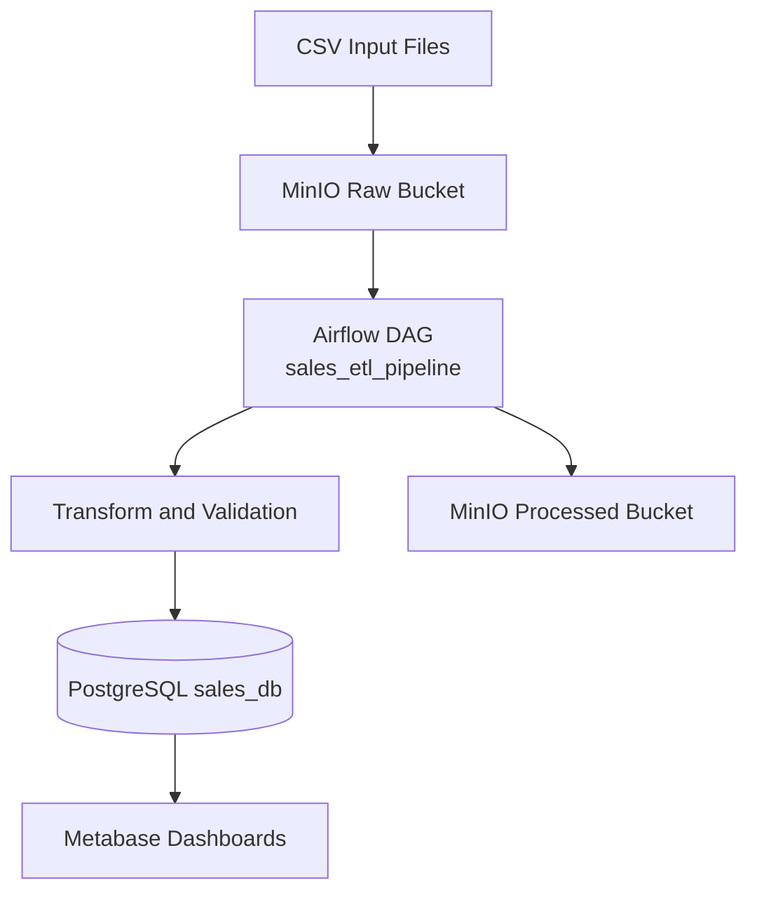

# Mini Sales Data Platform

## Overview
Mini Sales Data Platform is a containerized data platform for ingesting sales CSV files, orchestrating ETL with Airflow, storing curated data in PostgreSQL, and serving analytics through Metabase.

The platform is designed for:
- Repeatable local setup with Docker Compose
- Production-style container deployment
- CI/CD validation before release

## Architecture
The architecture is centered on a raw -> transformed -> analytics flow:



Detailed architecture documentation is available in `docs/architecture.md`.

## Technology Stack
- Orchestration: Apache Airflow 2.8.1
- Object Storage: MinIO
- Database: PostgreSQL 15
- Analytics: Metabase
- Container Runtime: Docker + Docker Compose
- CI/CD: GitHub Actions + GHCR

## Repository Structure
```text
Mini-Data-Platform/
|- .github/workflows/            # CI/CD workflows
|- database/init/                # Database bootstrap SQL
|- docker/                       # Compose files and runtime configs
|- docs/                         # Architecture and project docs
|- pipelines/dags/               # Airflow DAGs and ETL utilities
|- services/
|  |- data_generator/            # Synthetic data generator
|  |- storage_init/              # MinIO bucket initializer
|- storage/sample_data/          # Local sample CSVs
|- README.md
```

## Setup Instructions (Local)
### 1) Prerequisites
- Docker Desktop (or Docker Engine + Compose v2)
- Git
- Minimum recommended host resources: 4 CPU, 8 GB RAM

### 2) Configure environment variables
Copy the provided example file:

Windows PowerShell:
```powershell
Copy-Item docker/.test_env.example docker/.env
```

Linux/macOS Bash:
```bash
cp docker/.test_env.example docker/.env
```

Edit `docker/.env` and set secure values for production use.

### 3) Start the platform
```bash
docker compose -f docker/docker-compose.yml up -d --build
```

### 4) Verify running services
```bash
docker ps
```

Expected service endpoints:
- Airflow UI: `http://localhost:8080` (default user: `admin`, password: `admin`)
- MinIO API: `http://localhost:9000`
- MinIO Console: `http://localhost:9001` (credentials from `docker/.env`)
- Metabase: `http://localhost:3000`

## Running the Data Flow
### Option A: Generate sample data
```bash
docker compose -f docker/docker-compose.yml run --rm data-generator
```

### Option B: Upload your own CSV to MinIO raw bucket
- Bucket: `sales-raw`
- Object format: CSV aligned with ETL input schema

### Trigger ETL manually
```bash
docker exec mini-airflow-web airflow dags unpause sales_etl_pipeline
docker exec mini-airflow-web airflow dags trigger sales_etl_pipeline
```

### Validate load result
```bash
docker exec mini_postgres psql -U <POSTGRES_USER> -d <POSTGRES_DB> -c "SELECT COUNT(*) FROM fact_sales;"
```

## Production Deployment
Production compose file: `docker/docker-compose.prod.yml`

### 1) Ensure external Docker network exists
```bash
docker network create mini-data-network
```

### 2) Ensure `docker/.env` is present on the deployment host
Use `docker/.test_env.example` as baseline and inject real secrets.

### 3) Pull and run production services
```bash
docker compose -f docker/docker-compose.prod.yml pull
docker compose -f docker/docker-compose.prod.yml up -d --remove-orphans
```

## CI/CD Overview
CI pipeline (`.github/workflows/ci.yml`) performs:
- Container build
- Infrastructure spin-up (Postgres + MinIO + Airflow)
- ETL DAG execution test
- Data validation in `fact_sales`
- Image tagging and push to GHCR (push events)

CD job on self-hosted runner:
- Checks out repository
- Generates production `.env`
- Pulls images from GHCR
- Restarts containers with production compose

## Operations
Stop services:
```bash
docker compose -f docker/docker-compose.yml down
```

Reset local state (destructive):
```bash
docker compose -f docker/docker-compose.yml down -v
```

## Troubleshooting
- `docker/.env not found`: ensure `docker/.env` exists before running compose.
- `network mini-data-network ... could not be found`: create the external network on deployment host.
- `denied: installation not allowed to Create organization package`: use GHCR PAT (`GHCR_TOKEN`) with `write:packages`, or enable org package publish permissions.
