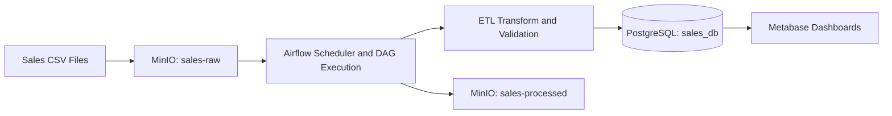
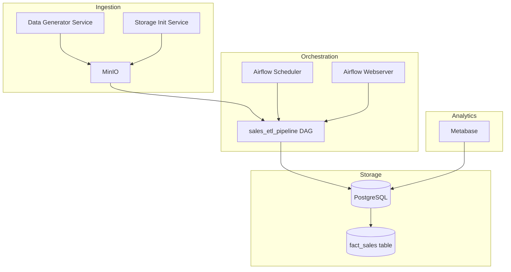
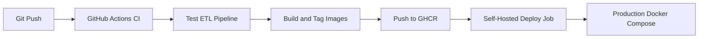

# Architecture and Data Flow

## High-Level Data Flow

## Runtime Component View

## Data Flow Stages
1. Raw data enters MinIO raw bucket (`sales-raw`).
2. Airflow DAG (`sales_etl_pipeline`) discovers and downloads pending CSV files.
3. ETL logic validates and transforms records into target model.
4. Transformed records are loaded into PostgreSQL analytical tables.
5. Successfully processed files are moved to MinIO processed bucket (`sales-processed`).
6. Metabase reads PostgreSQL for reporting and dashboards.

## CI/CD Flow

